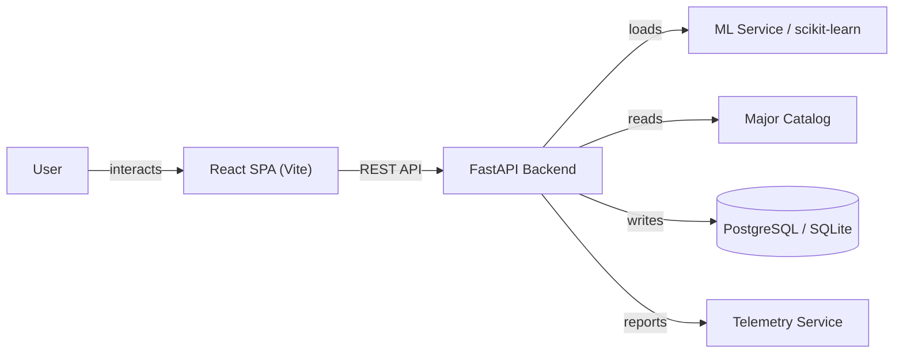

# Apti

College major recommendation system with ML (SHAP explainability), active learning, and glassmorphism UI.

## Overview

A full-stack recommendation system that suggests college majors based on student profiles and academic history. Backend provides a FastAPI inference service with scikit-learn models, SHAP explainability, and active learning feedback loops. Frontend is a React dashboard with glassmorphism UI for exploring recommendations and model explanations.

## Core Architecture



## System Components

| Component | Responsibility |
|---|---|
| `backend/app/` | FastAPI app, routes, schemas, services |
| `backend/app/services/` | ML inference, catalog, telemetry, retraining |
| `backend/ml/` | Dataset generation, training, evaluation |
| `backend/sql/` | Database schema |
| `backend/tests/` | Backend test suite |
| `frontend/src/` | React components and pages |

## Repository Layout

| Directory | Purpose |
|---|---|
| `backend/app/` | FastAPI application |
| `backend/ml/` | ML training and evaluation |
| `backend/sql/` | Database schema |
| `frontend/src/` | React frontend |

## Technology Stack

| Layer | Technology | Purpose |
|---|---|---|
| Frontend | React + Vite | Recommendation dashboard |
| Styling | Tailwind CSS | UI styling |
| Backend | FastAPI + Python | REST API and ML serving |
| ML | scikit-learn + SHAP | Recommendation model and explanations |
| Data | pandas, numpy | Dataset processing |
| Storage | joblib | Model serialization |

## Requirements

- Python 3.11+
- Node.js 18+
- npm

## Configuration

| File | Purpose |
|---|---|
| `backend/.env.example` | Backend environment variables |
| `frontend/.env.example` | Frontend API URL |
| `backend/railway.toml` | Deployment config |
| `frontend/vercel.json` | Frontend deployment config |

## Getting Started

```bash
# Backend
cd backend
python -m venv venv
source venv/bin/activate
pip install -r requirements.txt
uvicorn app.main:app --reload

# Frontend
cd frontend
npm install
npm run dev
```

## Development

```bash
cd backend && python -m pytest
cd frontend && npm test
```
